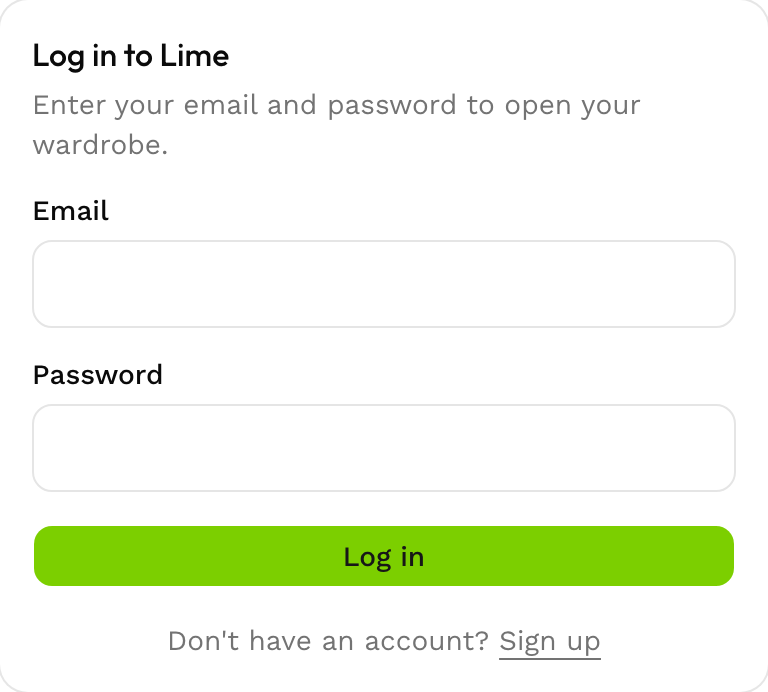
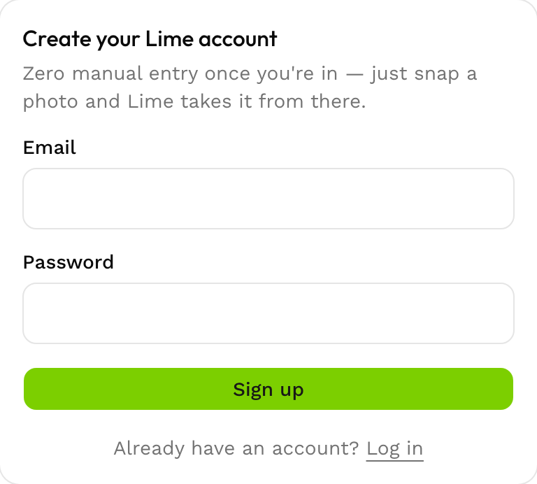
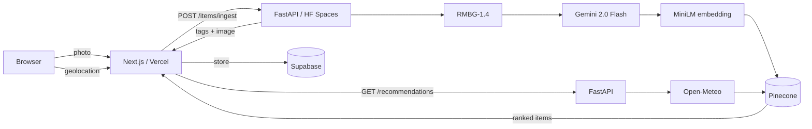

# Lime 🍋 — AI-Powered Digital Wardrobe

Lime turns a phone photo of a clothing item into a tagged, searchable entry in your digital closet — then uses vector search and live weather data to recommend outfits that actually go together.

**Live app:** [lime-wardrobe.vercel.app](https://lime-wardrobe.vercel.app)
**AI service:** [andrew-heejay-lime-backend.hf.space](https://andrew-heejay-lime-backend.hf.space/health)

<p align="center">
  
  &nbsp;&nbsp;
  
</p>

> Screenshots above are from the public sign-in flow. Wardrobe, ingestion, and the swipe deck require an account — see [Getting Started](#getting-started) to run it locally.

## What it does

- **Vision ingestion pipeline** — snap a photo of one item; a FastAPI service removes the background (`briaai/RMBG-1.4`), tags it with Gemini 2.0 Flash (category, silhouette, palette, texture, aesthetic), and embeds it for similarity search. No manual data entry.
- **Weather-aware recommendations** — on the styling deck, Lime fetches your local weather (Open-Meteo), turns it into a natural-language "ideal outfit" description, and re-ranks your wardrobe by aesthetic fit using vector search (Pinecone).
- **Tinder-style swipe deck** — swipe through tops, bottoms, and shoes (`framer-motion`) to put together outfits.
- **Wardrobe grid** — browse and filter your full digital closet by category.

## Tech stack

| Layer | Technology |
| :-- | :-- |
| Frontend | Next.js 16 (App Router), React 19, TypeScript, Tailwind CSS v4, shadcn/ui, framer-motion |
| Auth, database & storage | Supabase (Postgres, Auth, Storage) with Row Level Security |
| AI service | FastAPI (Python) |
| Background removal | `briaai/RMBG-1.4` via 🤗 transformers |
| Vision tagging | Gemini 2.0 Flash, structured output validated with Pydantic |
| Embeddings & search | `sentence-transformers/all-MiniLM-L6-v2` → Pinecone |
| Weather | Open-Meteo |
| Hosting | Vercel (frontend) · Hugging Face Spaces / Docker (AI service) |

## Architecture

Two independently deployed services joined by a shared UUID: Next.js owns UI, auth, and orchestration; FastAPI owns the entire ML pipeline and stays stateless.



Full write-up — including the ingestion and recommendation flows, data model, and key design decisions — is in [`docs/ARCHITECTURE.md`](docs/ARCHITECTURE.md).

## Getting started

### Prerequisites

- Node.js 20+ and Python 3.11+
- A [Supabase](https://supabase.com) project with [`supabase/schema.sql`](supabase/schema.sql) applied
- A [Pinecone](https://www.pinecone.io) index (384 dimensions, cosine metric)
- A [Gemini API](https://ai.google.dev/) key

### Backend (FastAPI)

```bash
cd backend
python -m venv .venv && source .venv/bin/activate
pip install -r requirements.txt
cp .env.example .env   # fill in GEMINI_API_KEY, PINECONE_API_KEY, PINECONE_INDEX_NAME
uvicorn app.main:app --reload --port 8001
```

### Frontend (Next.js)

```bash
cd frontend
npm install
cp .env.local.example .env.local   # fill in Supabase URL/anon key + BACKEND_URL
npm run dev
```

Visit [http://localhost:3000](http://localhost:3000) — you'll land on `/login` and can sign up for a new account.

## Project structure

```
.
├── frontend/    # Next.js app — UI, auth, server actions
├── backend/     # FastAPI AI microservice — tagging, embeddings, recommendations
├── supabase/    # Postgres schema + RLS policies
└── docs/        # Architecture, product requirements, technical design
```

## Documentation

- [`docs/ARCHITECTURE.md`](docs/ARCHITECTURE.md) — system design, pipelines, data model, key decisions
- [`docs/PRD.md`](docs/PRD.md) — product requirements and user journey
- [`docs/TECH_DESIGN.md`](docs/TECH_DESIGN.md) — original technical design and cost analysis

## License

[MIT](LICENSE)
