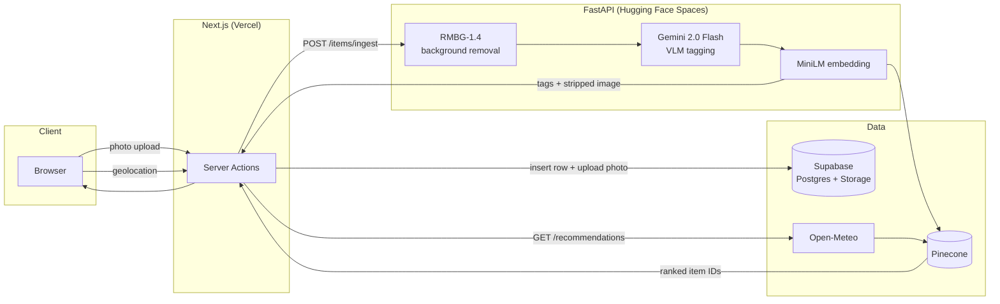

# Architecture

Lime is split into two independently deployed services plus a managed data layer:

- **Frontend** — Next.js (App Router), deployed on Vercel. Owns UI, auth, routing, and orchestration.
- **AI service** — FastAPI, deployed as a Docker Space on Hugging Face. Owns the entire ML pipeline (background removal, VLM tagging, embeddings, vector search) and stays stateless.
- **Data layer** — Supabase (Postgres + Auth + Storage) for user data and photos, Pinecone for vector search, Open-Meteo for weather.

The frontend never runs ML models or calls Gemini directly, and the AI service never touches Postgres — they're joined only by a shared UUID (see [Vision Ingestion Pipeline](#vision-ingestion-pipeline)).

## System diagram

## Vision Ingestion Pipeline

Triggered from `/ingest` when a user uploads a photo:

1. **Upload** — A Next.js Server Action (`frontend/src/app/ingest/actions.ts`) reads the authenticated user's session and forwards the raw photo plus `user_id` to `POST /items/ingest`.
2. **Background removal** — FastAPI strips the background with `briaai/RMBG-1.4` via the `transformers` image-segmentation pipeline, returning a transparent PNG.
3. **VLM tagging** — The stripped image is sent to Gemini 2.0 Flash with a structured-output schema, returning `{category, silhouette, palette, texture, aesthetic}`. The response is re-validated against a Pydantic model (`ItemTags`) as a second guard against malformed JSON — Gemini's `responseSchema` constrains generation, but the API boundary trusts nothing.
4. **Embedding + indexing** — The tags are rendered into a natural-language sentence (e.g. *"A slim wool blazer in charcoal, with a smooth texture, styled as preppy."*) and embedded with `all-MiniLM-L6-v2` (384-dim). The vector is upserted into Pinecone with `user_id` and `category` as metadata.
5. **ID handoff** — FastAPI mints a UUID that becomes both the Pinecone vector ID and the future Postgres `items.id`. This is the only state FastAPI "owns" — it lets the two stores stay joined without the AI service ever connecting to Postgres.
6. **Persistence** — The Server Action receives `{item_id, tags, stripped_image_base64}`, uploads the stripped PNG to Supabase Storage at `{user_id}/{item_id}.png`, and inserts a row into `items`.

## Recommendation Engine

Triggered on `/deck` when the styling deck loads:

1. The browser's Geolocation API supplies coordinates (optional — declining just keeps the deck's default most-recent-first order).
2. Next.js calls `GET /recommendations?user_id=...&latitude=...&longitude=...`.
3. FastAPI calls Open-Meteo for the current temperature and weather code, then maps it to a natural-language "ideal outfit" sentence — bucketed by *feel* (e.g. *"a light, breathable outfit for warm weather"*) rather than exact degrees, since the embedding model matches descriptive language, not numbers.
4. That sentence is embedded with the same MiniLM model and used to query Pinecone three times — once per category (`top`/`bottom`/`shoes`) — filtered to `user_id`, returning the nearest neighbors ranked by aesthetic match.
5. The frontend reorders each swipe stack so the top match surfaces first; the rest of the wardrobe keeps its original order behind it.

## Data model

Three tables in Supabase Postgres (full schema in [`supabase/schema.sql`](../supabase/schema.sql)), all RLS-scoped to `auth.uid()`:

| Table | Purpose |
| :-- | :-- |
| `profiles` | 1:1 with `auth.users`, auto-created on signup via trigger |
| `items` | One row per clothing item — `category`, `image_url`, `tags` (jsonb), `embedding_id` (Pinecone vector ID, same as `items.id`) |
| `outfits` | Locked outfit combinations from the swipe deck — `top_item_id` / `bottom_item_id` / `shoes_item_id` + optional weather snapshot |

Photos live in a private `clothing-photos` Storage bucket, folder-scoped per user (`clothing-photos/{user_id}/{filename}`), enforced by storage RLS policies. The frontend reads them via short-lived signed URLs.

## Key design decisions

- **Two services, hard boundary.** FastAPI owns all ML/AI work and stays stateless; Next.js owns UI, auth, and orchestration. This keeps heavy ML dependencies (`torch`, `transformers`) out of the Vercel deployment and lets each side redeploy independently.
- **Sentence-based embeddings.** Sentence-transformer models are trained on prose, not key:value pairs — a descriptive sentence captures the relationship between silhouette, color, and texture far better than a flat field dump.
- **Weather as "feel," not degrees.** Bucketing temperature into outfit-appropriateness language lets the same embedding model used for item tags also rank weather fit, without a separate numeric model.
- **Defense-in-depth JSON validation.** Gemini's structured-output mode constrains the schema at generation time; Pydantic re-validates at the API boundary so malformed VLM output can never reach Pinecone or Postgres.
- **`all-MiniLM-L6-v2` over a hosted embedding API.** Runs locally (no extra network hop or rate limit), keeps the dependency family aligned with RMBG-1.4 (both `transformers`/`torch`-based), and matches the 384-dim Pinecone index.

## Error handling

Every external call (RMBG-1.4, Gemini, Pinecone, Open-Meteo) is wrapped in a typed exception (`TaggingError`, `WeatherError`, etc.) and converted to a `502` with a user-facing message — never a raw `500`. The frontend treats AI tagging and weather-based recommendations as enhancements: if either fails, the user can still browse and swipe their wardrobe with default ordering.

## Testing

- `pytest` for backend unit/integration tests — pipeline stages and Pydantic validation against malformed VLM output.
- Manual mobile-viewport checks for swipe gesture responsiveness.
- [`lime-backend/scripts/smoke_test.py`](../../lime-backend/scripts/smoke_test.py) — one-off connectivity check for Supabase, Pinecone, and Gemini credentials.
